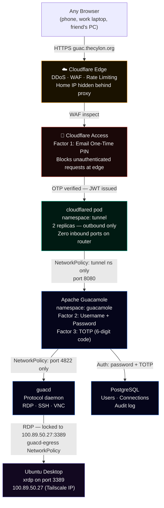
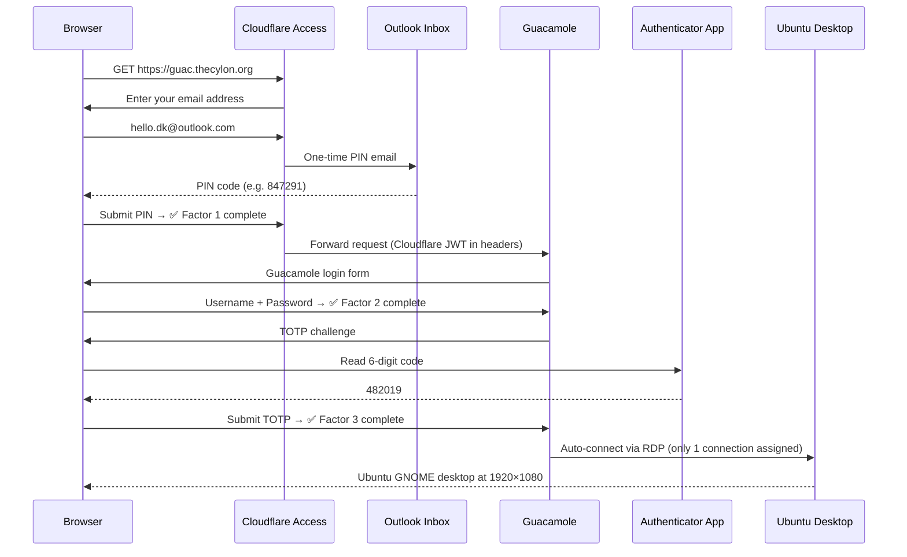
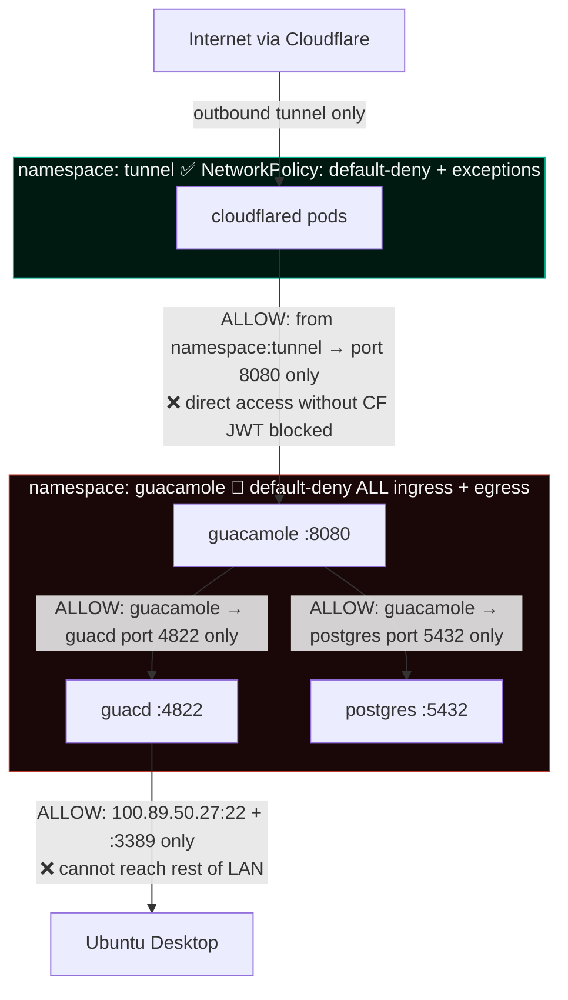
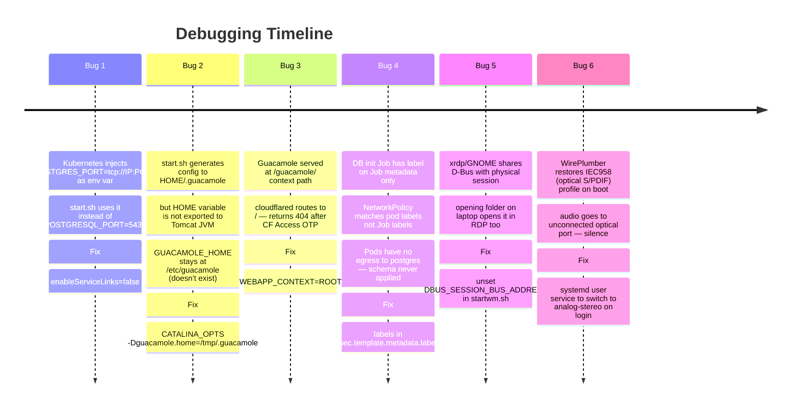
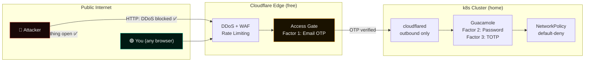

# Browser-Based Ubuntu Desktop with 3-Factor Auth and Zero Open Ports

> Access your home lab from anywhere — Google OTP, Guacamole password, TOTP — then land directly on your Ubuntu desktop. No VPN client. No open ports. Free.
---

## The Problem

Working remotely from a home lab usually means one of three bad options:

- **Port-forward SSH/RDP** — your home IP is exposed, one misconfiguration away from the internet
- **Commercial VPN** — monthly cost, vendor dependency, client software on every device
- **Tailscale/ZeroTier** — great, but still needs a client installed on every machine you work from

I wanted to open a browser tab, authenticate three times, and land on a full Ubuntu GNOME desktop — from any device, anywhere, with zero ports open on the home router.

Here's exactly how I built it.

---

## Architecture



---

## Authentication Flow



---

## Prerequisites

### Accounts and Services

| Requirement | Notes |
|---|---|
| Cloudflare account (free) | Domain must be on Cloudflare nameservers |
| Domain on Cloudflare | e.g. `thecylon.org` |
| Cloudflare Zero Trust team | Free — create at one.dash.cloudflare.com → Zero Trust |
| Email account for OTP | Outlook, Gmail, or any email works |
| Authenticator app | Google Authenticator, Aegis, Authy, etc. |

### Hardware and Software

| Requirement | Notes |
|---|---|
| Linux machine (the target) | Ubuntu 22.04 or 24.04 recommended |
| Kubernetes cluster | k0s, k3s, k8s — any distribution |
| `cloudflared` CLI | [Cloudflare Tunnel client](https://github.com/cloudflare/cloudflared) |
| `kubectl` | Access to your cluster |
| `xrdp` | `sudo apt install xrdp` |
| GNOME desktop | `sudo apt install gnome-session gnome-shell` |
| Docker (for image inspection) | Optional — to pin image digests |

### What You Need to Know

- Basic Kubernetes (kubectl apply, namespaces, Deployments, Services)
- Basic Cloudflare DNS management
- Comfortable running commands as root on Linux

---

## Implementation

### Step 1 — Create the Cloudflare Tunnel

```bash
# Install cloudflared
curl -L https://pkg.cloudflare.com/cloudflare-main.gpg | sudo tee /usr/share/keyrings/cloudflare-main.gpg >/dev/null
echo 'deb [signed-by=/usr/share/keyrings/cloudflare-main.gpg] https://pkg.cloudflare.com/cloudflared any main' | sudo tee /etc/apt/sources.list.d/cloudflared.list
sudo apt update && sudo apt install cloudflared

# Login and create tunnel
cloudflared tunnel login
cloudflared tunnel create guacamole-tunnel

# Point DNS to the tunnel
cloudflared tunnel route dns guacamole-tunnel guac.yourdomain.com
```

Get the tunnel ID — you'll need it in the ConfigMap:

```bash
cloudflared tunnel info guacamole-tunnel
# Note the UUID: 2f7f7ca5-0e69-453e-8592-ffe236bd8798
```

---

### Step 2 — Create Kubernetes Namespaces

```yaml
# k8s/namespaces.yaml
apiVersion: v1
kind: Namespace
metadata:
  name: tunnel
  labels:
    name: tunnel     # required by NetworkPolicy namespaceSelector
---
apiVersion: v1
kind: Namespace
metadata:
  name: guacamole
  labels:
    name: guacamole
```

```bash
kubectl apply -f k8s/namespaces.yaml
```

---

### Step 3 — Deploy cloudflared (Tunnel)

**Get the tunnel token:**
```bash
cloudflared tunnel token guacamole-tunnel
# Copy the base64 token output
```

**Create the Secret:**
```bash
kubectl create secret generic cloudflared-token \
  --namespace tunnel \
  --from-literal=token='<PASTE TOKEN HERE>'
```

**ConfigMap** — replace `<TUNNEL-UUID>` and `yourdomain.com`:

```yaml
# k8s/tunnel/configmap.yaml
apiVersion: v1
kind: ConfigMap
metadata:
  name: cloudflared-config
  namespace: tunnel
data:
  config.yaml: |
    tunnel: <TUNNEL-UUID>
    metrics: 0.0.0.0:2000
    no-autoupdate: true
    ingress:
      - hostname: guac.yourdomain.com
        service: http://guacamole-svc.guacamole.svc.cluster.local:8080
      - service: http_status:404
```

**Pin the image digest before deploying** (never use `:latest` in production):

```bash
docker pull cloudflare/cloudflared:latest
docker inspect cloudflare/cloudflared:latest --format='{{index .RepoDigests 0}}'
# cloudflare/cloudflared@sha256:6b599ca3e974349ead3286d178da61d291961182ec3fe9c505e1dd02c8ac31b0
```

**Deployment:**

```yaml
# k8s/tunnel/deployment.yaml
apiVersion: apps/v1
kind: Deployment
metadata:
  name: cloudflared
  namespace: tunnel
spec:
  replicas: 2        # HA — two connections to Cloudflare PoPs
  selector:
    matchLabels:
      app: cloudflared
  template:
    metadata:
      labels:
        app: cloudflared
    spec:
      securityContext:
        runAsNonRoot: true
        runAsUser: 65532
      containers:
        - name: cloudflared
          image: cloudflare/cloudflared@sha256:<DIGEST>
          args: [tunnel, --config, /etc/cloudflared/config/config.yaml, run]
          env:
            - name: TUNNEL_TOKEN
              valueFrom:
                secretKeyRef:
                  name: cloudflared-token
                  key: token
          resources:
            requests:
              memory: 64Mi
              cpu: 50m
            limits:
              memory: 128Mi
              cpu: 200m
          livenessProbe:
            httpGet:
              path: /ready
              port: 2000
            initialDelaySeconds: 10
            periodSeconds: 10
          readinessProbe:
            httpGet:
              path: /ready
              port: 2000
            initialDelaySeconds: 10
            periodSeconds: 10
          volumeMounts:
            - name: config
              mountPath: /etc/cloudflared/config
              readOnly: true
      volumes:
        - name: config
          configMap:
            name: cloudflared-config
```

---

### Step 4 — Deploy Guacamole Stack

#### Secrets

```bash
# Generate a strong DB password
DB_PASS=$(openssl rand -base64 24 | tr -dc 'a-zA-Z0-9' | head -c 32)
kubectl create secret generic guacamole-db-creds \
  --namespace guacamole \
  --from-literal=POSTGRES_DB=guacamole \
  --from-literal=POSTGRES_USER=guacamole \
  --from-literal=POSTGRES_PASSWORD="$DB_PASS"
echo "DB password: $DB_PASS"   # save this!
```

#### PostgreSQL StatefulSet

```yaml
# k8s/guacamole/postgres-statefulset.yaml
apiVersion: apps/v1
kind: StatefulSet
metadata:
  name: postgres
  namespace: guacamole
spec:
  serviceName: postgres
  replicas: 1
  selector:
    matchLabels:
      app: postgres
  template:
    metadata:
      labels:
        app: postgres
    spec:
      securityContext:
        runAsUser: 999
        fsGroup: 999
      containers:
        - name: postgres
          image: postgres:16-alpine
          env:
            - name: POSTGRES_DB
              valueFrom:
                secretKeyRef:
                  name: guacamole-db-creds
                  key: POSTGRES_DB
            - name: POSTGRES_USER
              valueFrom:
                secretKeyRef:
                  name: guacamole-db-creds
                  key: POSTGRES_USER
            - name: POSTGRES_PASSWORD
              valueFrom:
                secretKeyRef:
                  name: guacamole-db-creds
                  key: POSTGRES_PASSWORD
          volumeMounts:
            - name: postgres-data
              mountPath: /var/lib/postgresql/data
          resources:
            requests:
              memory: 128Mi
              cpu: 100m
            limits:
              memory: 256Mi
  volumeClaimTemplates:
    - metadata:
        name: postgres-data
      spec:
        accessModes: [ReadWriteOnce]
        resources:
          requests:
            storage: 2Gi
```

#### Database Schema Init Job

A key lesson: Guacamole requires schema initialisation before first run. The init Job uses an `initContainer` to generate the SQL, then a second container to apply it — with an idempotency check so re-runs are safe:

```yaml
# k8s/guacamole/db-init-job.yaml
apiVersion: batch/v1
kind: Job
metadata:
  name: guacamole-db-init
  namespace: guacamole
  labels:
    app: guacamole-db-init   # must be on pod template too — NetworkPolicy uses pod labels
spec:
  ttlSecondsAfterFinished: 120
  backoffLimit: 3
  template:
    metadata:
      labels:
        app: guacamole-db-init   # ← critical: NetworkPolicy matches pod labels, not Job labels
    spec:
      restartPolicy: Never
      initContainers:
        - name: generate-sql
          image: guacamole/guacamole:1.5.5
          command: ["/bin/sh", "-c"]
          args:
            - "/opt/guacamole/bin/initdb.sh --postgresql > /sql/initdb.sql"
          volumeMounts:
            - name: sql
              mountPath: /sql
      containers:
        - name: apply-sql
          image: postgres:16-alpine
          command: ["/bin/sh", "-c"]
          args:
            - |
              TABLE_EXISTS=$(PGPASSWORD=$POSTGRES_PASSWORD psql -h postgres \
                -U $POSTGRES_USER -d $POSTGRES_DB -tAc \
                "SELECT to_regclass('public.guacamole_user')")
              if [ "$TABLE_EXISTS" = "public.guacamole_user" ]; then
                echo "Schema already exists, skipping"
                exit 0
              fi
              PGPASSWORD=$POSTGRES_PASSWORD psql -h postgres \
                -U $POSTGRES_USER -d $POSTGRES_DB -f /sql/initdb.sql && \
              echo "Schema applied"
          env:
            - { name: POSTGRES_DB,   valueFrom: { secretKeyRef: { name: guacamole-db-creds, key: POSTGRES_DB } } }
            - { name: POSTGRES_USER, valueFrom: { secretKeyRef: { name: guacamole-db-creds, key: POSTGRES_USER } } }
            - { name: POSTGRES_PASSWORD, valueFrom: { secretKeyRef: { name: guacamole-db-creds, key: POSTGRES_PASSWORD } } }
          volumeMounts:
            - name: sql
              mountPath: /sql
      volumes:
        - name: sql
          emptyDir: {}
```

#### Guacamole Deployment

Three env vars are critical and non-obvious (see Lessons Learned below):

```yaml
# k8s/guacamole/guacamole-deployment.yaml
apiVersion: apps/v1
kind: Deployment
metadata:
  name: guacamole
  namespace: guacamole
spec:
  replicas: 1
  selector:
    matchLabels:
      app: guacamole
  template:
    metadata:
      labels:
        app: guacamole
    spec:
      enableServiceLinks: false    # prevents POSTGRES_PORT k8s env var pollution
      containers:
        - name: guacamole
          image: guacamole/guacamole:1.5.5
          ports:
            - containerPort: 8080
          env:
            - name: HOME
              value: /tmp          # image requires writable home dir
            - name: CATALINA_OPTS
              value: "-Dguacamole.home=/tmp/.guacamole"   # tells Tomcat where config lives
            - name: WEBAPP_CONTEXT
              value: ROOT          # serves at / instead of /guacamole/ — fixes 404
            - name: TOTP_ENABLED
              value: "true"
            - name: TOTP_ISSUER
              value: "yourdomain.com"
            - name: GUACD_HOSTNAME
              value: guacd
            - name: GUACD_PORT
              value: "4822"
            - name: POSTGRESQL_HOSTNAME
              value: postgres
            - name: POSTGRESQL_PORT
              value: "5432"
            - name: POSTGRESQL_DATABASE
              valueFrom:
                secretKeyRef:
                  name: guacamole-db-creds
                  key: POSTGRES_DB
            - name: POSTGRESQL_USER
              valueFrom:
                secretKeyRef:
                  name: guacamole-db-creds
                  key: POSTGRES_USER
            - name: POSTGRESQL_PASSWORD
              valueFrom:
                secretKeyRef:
                  name: guacamole-db-creds
                  key: POSTGRES_PASSWORD
          resources:
            requests:
              memory: 256Mi
              cpu: 100m
            limits:
              memory: 512Mi
              cpu: 500m
```

---

### Step 5 — NetworkPolicy: Default-Deny Everything



The `guacd-egress` policy is the most important one — it locks guacd to connecting only to your specific machine on specific ports. A compromised Guacamole pod cannot pivot to the rest of your LAN:

```yaml
apiVersion: networking.k8s.io/v1
kind: NetworkPolicy
metadata:
  name: guacd-egress
  namespace: guacamole
spec:
  podSelector:
    matchLabels:
      app: guacd
  policyTypes:
    - Egress
  egress:
    - to:
        - ipBlock:
            cidr: 100.89.50.27/32    # your machine's IP only
      ports:
        - port: 22
          protocol: TCP
        - port: 3389
          protocol: TCP
    - ports:
        - port: 53
          protocol: UDP              # DNS only
```

---

### Step 6 — Configure Cloudflare Access

In **one.dash.cloudflare.com → Zero Trust → Access → Applications**:

1. Add Application → Self-hosted
2. Application domain: `guac.yourdomain.com`
3. Session duration: 8 hours
4. Identity provider: One-time PIN (no IDP setup required)
5. Policy: Email is `your@email.com`

---

### Step 7 — Configure xrdp for Ubuntu GNOME

```bash
sudo apt install xrdp gnome-session gnome-shell

# Configure xrdp to launch GNOME
cat > ~/.xsession << 'EOF'
export GNOME_SHELL_SESSION_MODE=ubuntu
export XDG_SESSION_TYPE=x11
export XDG_CURRENT_DESKTOP=ubuntu:GNOME
export XDG_SESSION_DESKTOP=ubuntu
unset DBUS_SESSION_BUS_ADDRESS
unset DBUS_SESSION_BUS_PID
exec dbus-launch --exit-with-session gnome-session
EOF

# Suppress color manager auth popups in GNOME
sudo tee /etc/polkit-1/localauthority/50-local.d/45-allow-colord.pkla << 'EOF'
[Allow Colord all Users]
Identity=unix-user:*
Action=org.freedesktop.color-manager.create-device;org.freedesktop.color-manager.create-profile;org.freedesktop.color-manager.delete-device;org.freedesktop.color-manager.delete-profile;org.freedesktop.color-manager.modify-device;org.freedesktop.color-manager.modify-profile
ResultAny=no
ResultInactive=no
ResultActive=yes
EOF
```

---

### Step 8 — Isolate xrdp Sessions from Physical Display

Without this fix, opening a folder on the laptop also opens it in the RDP session — they share the same D-Bus.

```bash
sudo tee /etc/xrdp/startwm.sh << 'EOF'
#!/bin/sh
if test -r /etc/profile; then . /etc/profile; fi
if test -r ~/.profile; then . ~/.profile; fi

# Isolate D-Bus: prevent xrdp session from attaching to the physical
# display's session bus. Without this, apps like Nautilus respond on
# both the laptop screen and the RDP window simultaneously.
unset DBUS_SESSION_BUS_ADDRESS
unset DBUS_SESSION_BUS_PID
export GNOME_SESSION_DONT_SAVE=1

test -x /etc/X11/Xsession && exec /etc/X11/Xsession
exec /bin/sh /etc/X11/Xsession
EOF

sudo systemctl restart xrdp
```

---

## Lessons Learned (The Hard Bugs)



---

## Audio Isolation Fix

After reboot, audio was silent — WirePlumber restored an IEC958 (optical S/PDIF) profile from a previous session. The USB audio adapter's 3.5mm jack needs the analog stereo profile.

```bash
# Switch profile immediately
pactl set-card-profile \
  alsa_card.usb-ASUSTeK_COMPUTER_INC._C-Media_R__Audio-00 \
  output:analog-stereo+input:analog-stereo

# Make it permanent via systemd user service
cat > ~/.config/systemd/user/audio-profile-fix.service << 'EOF'
[Unit]
Description=Set USB audio to analog stereo profile
After=wireplumber.service pipewire-pulse.service
Requires=wireplumber.service

[Service]
Type=oneshot
ExecStartPre=/bin/sleep 3
ExecStart=/bin/bash -c '\
  pactl set-card-profile \
    alsa_card.usb-ASUSTeK_COMPUTER_INC._C-Media_R__Audio-00 \
    output:analog-stereo+input:analog-stereo && \
  SINK=$(pactl list sinks short | awk "/analog/{print \$1}" | head -1) && \
  pactl set-default-sink "$SINK"'
RemainAfterExit=yes

[Install]
WantedBy=default.target
EOF

systemctl --user daemon-reload
systemctl --user enable --now audio-profile-fix.service
```

---

## Security Model



| Layer | What it stops |
|---|---|
| Zero open ports | Port scans find nothing — home IP never exposed |
| Cloudflare WAF | DDoS, OWASP Top 10, rate limiting |
| Cloudflare Access OTP | Unauthenticated access — even if they find the URL |
| Guacamole password | Must know credentials even after passing CF Access |
| Guacamole TOTP | Brute force and credential stuffing |
| NetworkPolicy default-deny | Compromised container cannot pivot to LAN |
| guacd-egress lock | guacd can only reach specific IP:port — no LAN traversal |

**Total cost: $0/month.**

---

## Quick Reference

```
# Check tunnel is connected
cloudflared tunnel info guacamole-tunnel

# Check all guacamole pods are Running
kubectl get pods -n guacamole

# Check cloudflared is routing
kubectl logs -n tunnel deployment/cloudflared --tail=20

# Test guacd can reach the laptop
GUACD=$(kubectl get pod -n guacamole -l app=guacd -o jsonpath='{.items[0].metadata.name}')
kubectl exec -n guacamole $GUACD -- wget -qO- --timeout=3 http://100.89.50.27:22 2>&1 | head -1
# Expected: SSH-2.0-OpenSSH_...

# Check audio profile
pactl list cards | grep "Active Profile"

# Restart audio fix service
systemctl --user restart audio-profile-fix.service
```

---

## What's Next

- **Phase 2**: Add OPNsense as a network gateway between ISP router and switch — VLAN isolation for the k8s cluster, Suricata IDS/IPS, firewall rule blocking k8s → home devices
- **Sealed Secrets**: Encrypt the k8s Secrets at rest with the Bitnami Sealed Secrets operator
- **Falco**: Runtime container anomaly detection — shell spawns, unexpected outbound connections
- **Monitoring**: Prometheus + Grafana + Alertmanager → mobile push via Ntfy

---

*Stack: Apache Guacamole 1.5.5 · k0s · Cloudflare Tunnel + Access · xrdp · PipeWire · WirePlumber · PostgreSQL 16 · Calico NetworkPolicy*
