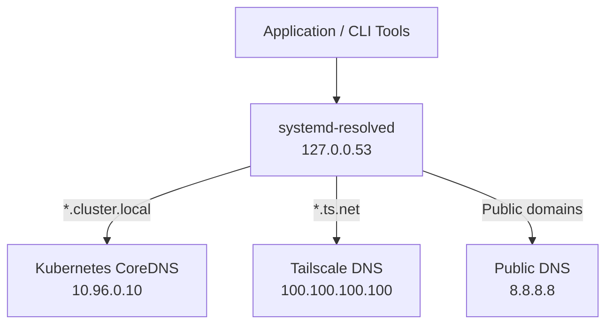
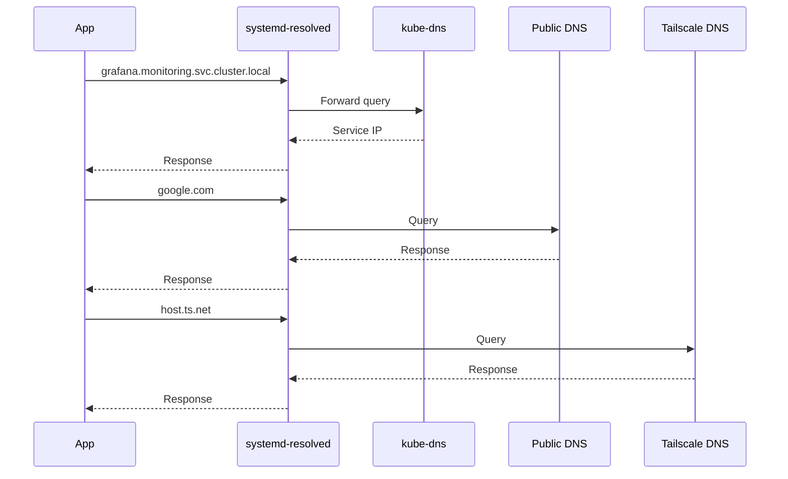
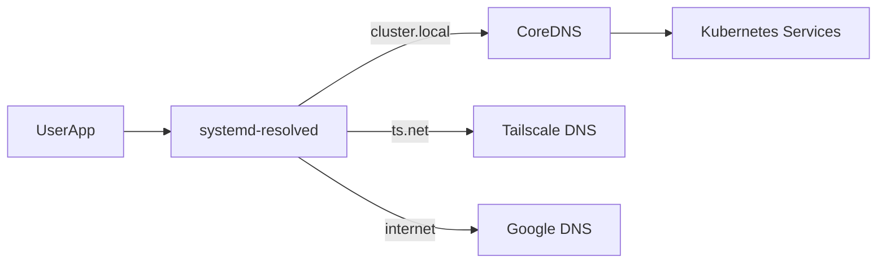

# Using Kubernetes kube-dns as a Resolver on Ubuntu 24.04 (systemd‑resolved Split DNS)

## Overview

Modern Ubuntu systems (including **Ubuntu 24.04**) use
**systemd-resolved** to manage DNS resolution.\
When working on a **Kubernetes node or DevOps workstation**, it is
extremely useful to resolve:

    *.svc.cluster.local
    *.cluster.local

directly from the host machine.

This allows engineers to access services like:

    grafana.monitoring.svc.cluster.local
    prometheus.monitoring.svc.cluster.local
    zabbix-server.monitoring.svc.cluster.local

without relying on `kubectl port-forward`.

This article shows how to configure **split DNS** so:

  Domain                DNS Server
  --------------------- ---------------------------
  `cluster.local`       Kubernetes kube-dns
  `svc.cluster.local`   Kubernetes kube-dns
  `ts.net`              Tailscale DNS
  Internet domains      Public DNS (Google, etc.)

------------------------------------------------------------------------

# Architecture

Below is the DNS architecture after configuration.



------------------------------------------------------------------------

# Environment

Example environment used in this guide:

  Component        Value
  ---------------- ------------------
  OS               Ubuntu 24.04
  Resolver         systemd-resolved
  Kubernetes DNS   10.96.0.10
  Internet DNS     8.8.8.8
  Tailscale DNS    100.100.100.100

------------------------------------------------------------------------

# Step 1 --- Find kube-dns Service IP

Retrieve the kube-dns service IP from Kubernetes.

``` bash
kubectl -n kube-system get svc kube-dns
```

Example output:

    NAME       TYPE        CLUSTER-IP   PORT(S)
    kube-dns   ClusterIP   10.96.0.10   53/UDP,53/TCP

This IP is the **DNS endpoint inside the Kubernetes cluster**.

------------------------------------------------------------------------

# Step 2 --- Configure systemd-resolved Split DNS

Create a resolver override configuration.

    sudo mkdir -p /etc/systemd/resolved.conf.d
    sudo nano /etc/systemd/resolved.conf.d/kubernetes.conf

Add:

    [Resolve]
    DNS=10.96.0.10
    Domains=~cluster.local ~svc.cluster.local

Important detail:

    ~domain

means **routing domain**.

It tells `systemd-resolved`:

> Only forward queries matching these domains to this DNS server.

------------------------------------------------------------------------

# Step 3 --- Restart the Resolver

    sudo systemctl restart systemd-resolved

------------------------------------------------------------------------

# Step 4 --- Verify DNS Configuration

Run:

    resolvectl status

Expected output:

    Global
    Current DNS Server: 10.96.0.10
    DNS Domain: ~cluster.local ~svc.cluster.local

You should also see your regular DNS servers for network interfaces:

    Link wlo1
    DNS Servers: 8.8.8.8 8.8.4.4

and optionally:

    Link tailscale0
    DNS Servers: 100.100.100.100

------------------------------------------------------------------------

# DNS Resolution Flow

The DNS resolution flow now looks like this:



------------------------------------------------------------------------

# Step 5 --- Test Kubernetes DNS

Test service resolution.

    resolvectl query kubernetes.default.svc.cluster.local

or

    dig kubernetes.default.svc.cluster.local

Example result:

    10.96.0.1

------------------------------------------------------------------------

# Access Services Directly

Once configured, you can access Kubernetes services directly from the
host.

Example:

    curl http://grafana.monitoring.svc.cluster.local

or

    curl http://prometheus.monitoring.svc.cluster.local

This dramatically simplifies debugging workflows.

------------------------------------------------------------------------

# Optional Enhancement --- Pod DNS

You can also add support for **Pod DNS records**.

Edit:

    sudo nano /etc/systemd/resolved.conf.d/kubernetes.conf

Update:

    [Resolve]
    DNS=10.96.0.10
    Domains=~cluster.local ~svc.cluster.local ~pod.cluster.local

Restart:

    sudo systemctl restart systemd-resolved

This allows resolving:

    10-244-1-5.default.pod.cluster.local

------------------------------------------------------------------------

# Benefits of this Setup

✔ Resolve Kubernetes services from your host\
✔ No need for port-forwarding\
✔ Works with multi-network setups\
✔ Supports VPN DNS (Tailscale)\
✔ Clean split DNS architecture

------------------------------------------------------------------------

# Final DNS Architecture



------------------------------------------------------------------------

# Conclusion

Using **systemd-resolved split DNS** with Kubernetes enables a very
powerful workflow for DevOps engineers.

You gain:

-   direct service discovery
-   simplified debugging
-   faster operations workflows
-   clean integration with VPN and public DNS

This approach is widely used by **platform engineers managing Kubernetes
clusters at scale**.
